# 🌐 UPI Mesh Simulator: Decentralized Offline Payments

The **UPI Mesh Simulator** is a full-stack proof-of-concept demonstrating how modern payment protocols (like India's UPI) can be extended to function in **completely offline environments** (zero internet connectivity) using device-to-device Bluetooth mesh networks.

This project solves the core computer science challenges of decentralized settlement: **Byzantine fault tolerance**, **gossip protocol propagation**, and **cryptographic idempotency** to prevent double-spending when intermittent networks reconnect to the central banking ledger.

---

## 🏗️ System Architecture

The project is split into two primary decoupled components:

1. **`UpiMeshApp` (React Native / Expo Frontend)**
   - Serves as the interactive simulator dashboard and mobile UI.
   - Built with NativeWind (Tailwind) for a premium Cyber-Fintech design system.
   - Manages local state (acting as the offline device memory) and visualizes the live mesh topology.
2. **`UPI_Without_Internet` (Spring Boot Backend)**
   - Simulates the central banking authority (Ledger) and the Idempotency Cache.
   - Built for high concurrency with `SERIALIZABLE` transaction isolation and pessimistic locking to handle sudden bursts of packets from bridging nodes.

---

## 🔄 How the Offline Protocol Works

The simulator relies on a multi-stage offline transfer process designed for untrusted environments.

### The Flow of a Packet

```mermaid
sequenceDiagram
    autonumber
    actor Alice (Offline)
    actor Bob (Offline)
    participant Mesh Network
    participant Bridge Node (Online)
    participant Bank Ledger (Spring Boot)

    Alice (Offline)->>Alice (Offline): 1. Creates Payment Packet
    Alice (Offline)->>Alice (Offline): 2. Signs Packet Cryptographically
    Alice (Offline)->>Bob (Offline): 3. Bluetooth Direct Transfer
    Bob (Offline)->>Mesh Network: 4. Gossip Broadcast (Spreading)
    Mesh Network->>Bridge Node (Online): 5. Packet Reaches Internet-Connected Node
    Bridge Node (Online)->>Bank Ledger (Spring Boot): 6. Flush / Upload Packet to Bank
    
    rect rgb(20, 40, 60)
    Note over Bank Ledger (Spring Boot): 7. Idempotency Check
    Bank Ledger (Spring Boot)->>Bank Ledger (Spring Boot): Hash exists in cache?
    alt Is Duplicate
        Bank Ledger (Spring Boot)-->>Bridge Node (Online): DROP (Already Settled)
    else Is New Packet
        Bank Ledger (Spring Boot)->>Bank Ledger (Spring Boot): Verify Signature & Deduct Funds
        Bank Ledger (Spring Boot)->>Bank Ledger (Spring Boot): Save Hash to Idempotency Cache
        Bank Ledger (Spring Boot)-->>Bridge Node (Online): ACK (Settled Successfully)
    end
    end
```


### 1. Cryptographic Packet Generation
When an offline user sends money, their device generates a unique JSON packet containing the sender, receiver, amount, and timestamp. The device then **cryptographically signs** this payload to ensure the receiver cannot tamper with the amount.

### 2. The Gossip Protocol
Since the sender has no internet, the packet is broadcasted via Bluetooth to nearby offline devices. Those devices store the packet and broadcast it to *their* neighbors. This ensures the packet eventually bounces across the network until it hits a device with internet access (a "Bridge Node").

### 3. Bridge Ingestion & Idempotency
When a Bridge Node connects to the internet, it uploads all stored packets to the Bank. Because the Gossip protocol duplicates packets exponentially, the Bank might receive the exact same transaction from 50 different devices at the exact same time.

To prevent Alice from being charged 50 times:
- The backend hashes the packet to generate a unique fingerprint.
- It attempts to insert the hash into an **Idempotency Cache**.
- A `SERIALIZABLE` database lock ensures that if two threads try to process the same packet at the exact millisecond, only the first one deducts the balance. All others are safely dropped.

---

## 🛠️ Getting Started (Local Development)

### Prerequisites
* **Node.js** (v18+) and `npm`
* **Java Development Kit** (JDK 21+)
* **Maven**

### Step 1: Start the Backend (Spring Boot)
1. Open a terminal and navigate to the backend directory:
   ```bash
   cd UPI_Without_Internet
   ```
2. Run the Spring Boot application using Maven:
   ```bash
   ./mvnw spring-boot:run
   ```
   *The backend starts on `http://localhost:8082` and automatically seeds the database.*

### Step 2: Start the Frontend (React Native Web)
1. Open a new terminal and navigate to the frontend directory:
   ```bash
   cd UpiMeshApp
   ```
2. Install the dependencies:
   ```bash
   npm install
   ```
3. Start the Expo development server on the web:
   ```bash
   npx expo start -c --web
   ```
   *The dashboard will open in your browser at `http://localhost:8081`.*

---

## 🧪 Testing the Simulator

Once the application is running, follow these steps to simulate a live offline transaction:

1. **Initiate Transfer**: Go to the **Send** tab on the left sidebar.
2. **Draft Payment**: Send ₹500 from Alice (`alice@upi`) to Bob (`bob@upi`). Since there is no internet, the packet is "queued" in the local device storage.
3. **Trigger Mesh Propagation**: Go to the **Dashboard** and click `Gossip Round`. You will see the packet counter increase on offline nodes as the transaction spreads across the mesh via Bluetooth emulation.
4. **Flush to Bank**: Click `Flush Bridges`. Watch the **Live Traffic Log**! You will see the backend receive duplicate packets from multiple devices, but the **Idempotency Cache** will ensure that the transaction settles exactly **once**, and all duplicates are safely ignored.

---

## ⚙️ Concurrency Safety

The core feature of the Spring Boot backend is the `SettlementService`. It is annotated with `@Transactional(isolation = Isolation.SERIALIZABLE)` to guarantee data consistency.

Even under high thread load (simulating dozens of devices uploading the same packet simultaneously), the strict locking mechanics prevent Optimistic Locking failures and guarantee that ledger balances remain perfectly mathematically accurate.

---

## 📜 License
This project is open-source and created to demonstrate resilient distributed systems and offline digital payment concepts.
